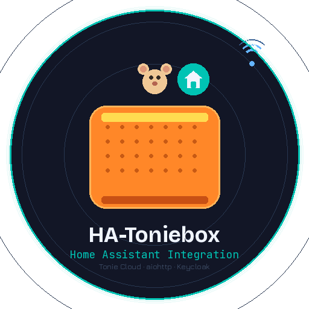

<p align="center">
  
</p>

<h1 align="center">HA-Toniebox</h1>

<p align="center">
  <strong>Unofficial Home Assistant Integration for the Toniebox / Tonie Cloud</strong><br/>
  Manage your Creative Tonies — browse chapters, sort & clear content — directly from Home Assistant.
</p>

<p align="center">
  <a href="https://github.com/hacs/integration">
    
  </a>
  
  
  
  
</p>

---

> [!WARNING]
> **Disclaimer — Please read before using**
>
> This project is **not affiliated with, endorsed by, or connected to Boxine GmbH** (the makers of Toniebox / tonies.de) **in any way**.
> It uses the undocumented Tonie Cloud REST API which **may change or break at any time without notice**.
> Use entirely **at your own risk**. No warranty, no guarantee, no support from Boxine.
>
> 🤖 This integration was **vibecoded** — generated with AI assistance ([Claude by Anthropic](https://anthropic.com)) and iteratively debugged. It is a community experiment, not production software.

---

## Features

- 🧸 Each Creative Tonie appears as a **media player entity** with cover art and chapter list
- 📊 **Sensors** for chapter count, total duration, and household overview
- 🔘 **Buttons** to sort chapters (by title / filename / date), clear all chapters, refresh
- 🔽 **Select entity** to choose sort order and apply with one tap
- ⚙️ **Services** for automation: `sort_chapters`, `clear_chapters`, `upload_audio`
- 🔐 Keycloak OpenID Connect authentication — same login as the Toniebox app
- 🛠️ Config Flow setup — **no YAML required**
- 📦 HACS compatible

---

## Installation via HACS

Adding HA-Toniebox to your Home Assistant can be done via HACS using this button:

[](https://my.home-assistant.io/redirect/hacs_repository/?owner=git4sim&repository=HA-Toniebox&category=integration)

> [!NOTE]
> If the button above doesn't work, add `https://github.com/git4sim/HA-Toniebox` manually as a Custom Repository of type **Integration** in HACS, then search for **Toniebox** and click Download.

After downloading, restart Home Assistant.

### Manual Installation

Copy the `custom_components/toniebox/` folder from the [latest release](https://github.com/git4sim/HA-Toniebox/releases/latest) into your HA config directory:

```
/config/custom_components/toniebox/
```

Restart Home Assistant.

---

## Configuration

Adding Toniebox to your Home Assistant instance can be done via the UI using this button:

[](https://my.home-assistant.io/redirect/config_flow_start?domain=toniebox)

> [!NOTE]
> If the button above doesn't work, go to **Settings → Devices & Services → Add Integration** and search for **Toniebox**.

Enter your **Toniebox account email and password** (same credentials as the [Toniebox app](https://tonies.com) or [my.tonies.com](https://my.tonies.com)).

---

## Entities

For each **household**:

| Entity | Description |
|---|---|
| `sensor.<household>_creative_tonies` | Number of Creative Tonies in this household |

For each **Creative Tonie**:

| Entity | Description |
|---|---|
| `media_player.toniebox_<n>` | Main entity — cover art, chapter list, state |
| `sensor.<n>_chapter_count` | Number of chapters loaded |
| `sensor.<n>_total_duration` | Total audio duration in minutes |
| `button.<n>_clear_all_chapters` | Remove all chapters |
| `button.<n>_sort_by_title` | Sort chapters A→Z |
| `button.<n>_sort_by_filename` | Sort by filename |
| `button.<n>_sort_by_date` | Sort by date |
| `button.<n>_refresh` | Force data refresh |
| `select.<n>_sort_chapters` | Sort & apply in one step |

---

## Services

### `toniebox.sort_chapters`

Sort the chapters on a Creative Tonie.

```yaml
service: toniebox.sort_chapters
data:
  entity_id: media_player.toniebox_mein_tonie
  sort_by: title   # title | filename | date
```

### `toniebox.clear_chapters`

Remove all chapters from a Creative Tonie.

```yaml
service: toniebox.clear_chapters
data:
  entity_id: media_player.toniebox_mein_tonie
```

### `toniebox.upload_audio`

Upload a local audio file as a new chapter.

```yaml
service: toniebox.upload_audio
data:
  entity_id: media_player.toniebox_mein_tonie
  file_path: /config/tonie_audio/maerchen.mp3
  title: "Rotkäppchen"
```

> [!NOTE]
> The file must be accessible from the Home Assistant host filesystem.

---

## Dashboard Example

```yaml
type: vertical-stack
cards:
  - type: picture-entity
    entity: media_player.toniebox_mein_tonie
    show_name: true
    show_state: true
  - type: entities
    entities:
      - sensor.toniebox_mein_tonie_chapter_count
      - sensor.toniebox_mein_tonie_total_duration
      - select.toniebox_mein_tonie_sort_chapters
  - type: horizontal-stack
    cards:
      - type: button
        entity: button.toniebox_mein_tonie_clear_all_chapters
        name: "🗑 Clear"
      - type: button
        entity: button.toniebox_mein_tonie_sort_by_title
        name: "🔤 A–Z"
      - type: button
        entity: button.toniebox_mein_tonie_refresh
        name: "🔄 Refresh"
```

---

## Debug Logging

To enable debug logging, add this to your `configuration.yaml`:

```yaml
logger:
  default: info
  logs:
    custom_components.toniebox: debug
```

Or enable it via **Settings → Devices & Services → Toniebox → Enable Debug Logging**.

---

## 🤖 About Vibecoding

This integration was built with **AI pair-programming** ([Claude by Anthropic](https://anthropic.com)) rather than written fully by hand. The architecture, authentication flow, and all platforms were generated iteratively with AI help and debugged against a real Toniebox account.

This means:
- It works, but **edge cases may exist**
- PRs, bug reports, and improvements are very welcome!

---

## Sources & Attribution

This project builds on reverse-engineering work by the community. All sources are credited for transparency:

| Source | License | What was used |
|---|---|---|
| [Wilhelmsson177/tonie-api](https://github.com/Wilhelmsson177/tonie-api) | MIT | API endpoint discovery, Python library concept |
| [maximilianvoss/toniebox-api](https://github.com/maximilianvoss/toniebox-api) | Apache-2.0 | All concrete API URLs from `Constants.java` |
| [toniebox-reverse-engineering/teddycloud](https://github.com/toniebox-reverse-engineering/teddycloud) | GPL-3.0 | Keycloak SSO flow documentation |
| [croesnick/toniebox-audio-match #15](https://github.com/croesnick/toniebox-audio-match/issues/15) | — | OpenID Connect endpoint research |

### API Endpoints (source: maximilianvoss/toniebox-api)

```
POST https://login.tonies.com/auth/realms/tonies/protocol/openid-connect/token
GET  https://api.tonie.cloud/v2/me
GET  https://api.tonie.cloud/v2/households
GET  https://api.tonie.cloud/v2/households/{id}/creativetonies
PATCH https://api.tonie.cloud/v2/households/{id}/creativetonies/{id}
```

> These are **undocumented, unofficial endpoints** belonging to Boxine GmbH. This project does not circumvent any DRM, copy protection, or access controls. It uses the same API the official app uses.

---

## Legal

- Released under the **[MIT License](LICENSE)**
- **Not affiliated with Boxine GmbH** in any way
- Toniebox® and Tonies® are registered trademarks of Boxine GmbH
- The Tonie Cloud API is undocumented — no guarantee of continued functionality
- Use in compliance with Boxine's [Terms of Service](https://tonies.com/terms)

---

<p align="center">Made with 🧸 + 🤖 + ☕ &nbsp;|&nbsp; <a href="https://github.com/git4sim/HA-Toniebox/issues">Report a Bug</a></p>
